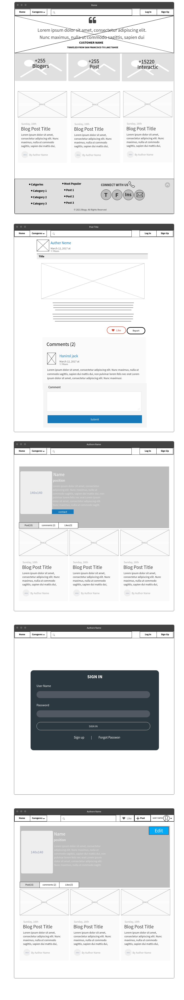
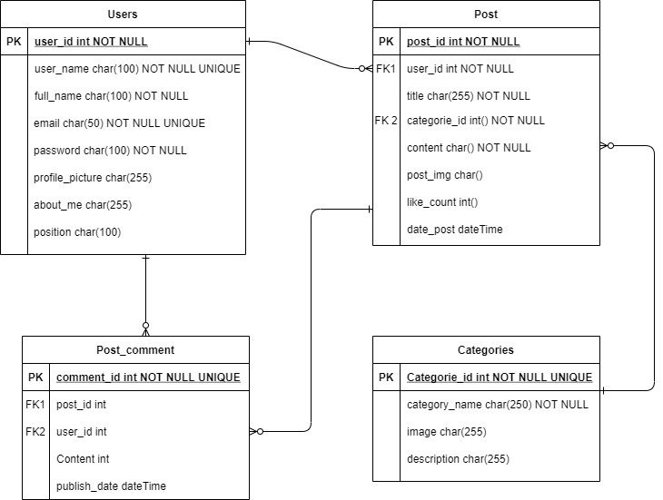
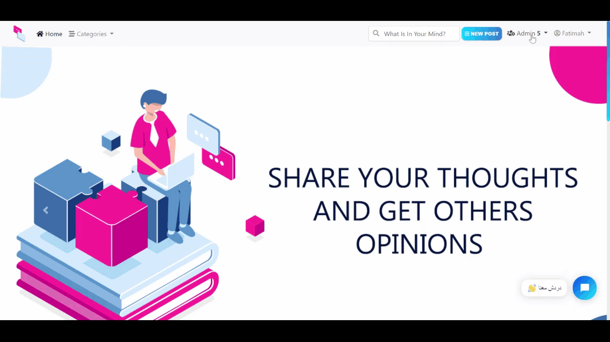

#  Blogy Project 

## Introduction
A blog is an online diary or journal located on a website. Users can create their own blog and post content that typically articles or sharing any information with others for engaging with them.

### Wireframe
Started the app by designing its layout framework by <a href= 'https://wireframepro.mockflow.com/'>mockflow</a>. 



### ERD
Designing the Entity Relationship Diagram by <a href= 'https://app.diagrams.net/'>Draw.io</a>



### Technologies Used.
* HTML
* CSS
* Bootstrap
* Postages 
* Python 
* Django 
* Ajax

### User Stories
#### Admin
* As admin, I should be able to manage blog website
* As admin, I should be able to create post and published directly
* As admin, I should be able to show list of reports
* As admin, I should be able to show list of publish post requests
* As admin, I should be able to confirm to publish a post on the website
* As admin, I should be able to refused publish a post 
* As admin, I should be able to show list of reports
* As admin, I should be able to access control panel

#### User
* As a User, I should be able to see the post content
* As a User, I should be able to search by post title
* As a User, I should be able to see author profile
* As a User, I should be able to filter the posts by its categories
* As a User, I should be able to sign up
* As a User, I should be able to log in
* As a User, I should be able to reset password
* As a User, I should be able to contact with author by email
* As a User, I should be able to share post link via Facebook, Twitter or Telegram

#### Visited User
* As a visitors User, I should not be neither able edit, delete on post content or add comments

#### Logged In User
* As a logged in user, I should be able to log out
* As a logged in user, I should be able to see all my posts with filtered by status   
* As a logged in user, I should be able to create new post
* As a logged in user, I should be able to edit own post
* As a logged in user, I should be able to delete own post
* As a logged in user, I should be able to add comments to any post
* As a logged in user, I should be able to add likes to the user's posts
* As a logged in user, I should be able to add unlikes to the user's posts
* As a logged in user, I should be able to see all likes posts list
* As a logged in user, I should be able to edit profile information
* As a logged in user, I should be able to report any post
* As a logged in user, H should be able to contact with admin via life chat 

## App Preview
- As a visitor, I can see all posts on the website and its information like the author to the post and his information.


 
- As a visitor, I can create my own account and edit it.


- As a logged-in user, I will be able to like the post, report to the admin, and add comments on posts. And create a new post, modify and delete it. Also, display all my posts and filter them by status, and display my like list


- As an admin, I can do all functions as a logged user in addition manages the blog website via the control panel and display reports, and publish post requests in order to confirm publish a post on the website or refused it.




### The Website Dimo 
You can visit Blogy website [link here](https://blogyproject.herokuapp.com/)

## API Endpoints
These are some of the EndPoints we used in this project

| #  |  Action  |  Method |  URL  |  Description  |
| :------------ | :------------ | :------------ | :------------ | :------------ |
|   1| INDEX  | GET  | / | To view Home page|
|   2|  CRAETE | POST  |   /login/ |  To login to the user account|
|   3| CREATE | POST  |/signup/   | To create new account|
|   4| INDEX | GET  |/profile/ | To show the user's profile|
|   5| CREATE | POST  |/profile/create/ | To allow the user signed up to create own profile|
|   6| UPDATE | PATCH  |/profile/<int:pk>/update/ | To allow the user logged in to modify own profile|
|   7| INDEX | GET  |/profile/<int:user_id>/ | To show specific user profile for others users|
|   8| CREATE  | POST  | /post/create/ | To create new post|
|   9| INDEX | GET  | /post/post_id/ | To veiw exist post|
|   10| UPDATE | PATCH  | /post/<int:pk>/update/  | To edit a specific post|
|   11|    DELETE |DELETE   | /post/<int:pk>/delete/  | To delete a specific post|
|   12|   INDEX | get  |  /user/posts/|  To view all user's posts list|
|   13|   INDEX |get   |  /user/posts/published/ | To view all user's published posts list | 
|   14|    INDEX |get   | /user/posts/notPublished/  | To view all user's not published posts list |
|   15|    INDEX |get   | /user/posts/refused/  | To view all user's refused posts list|
|   16|    INDEX |POST   |  /user/posts/draft/ | To view all user's draft posts list|
|   17|    CREATE |POST   |  /category/create/ | To create new category|
|   18|    INDEX |GET   | /category/<int:pk>/  | To view the list of categories |
|   19|    INDEX |GET   | /post/<int:post_id>/ | To view a specific post details |
|   20|    CREATE |POST   | /post/create/  | To create new post|
|   21|    DELETE |DELETE   | /post/<int:pk>/delete/  | To delete a specific post|
|   22|    CREATE |POST   | /comment/  | To allow the logged-in user to add a comment to an existing post|
|   23|    UPDATE |PATCH   | /comment/update/  | To allow the logged-in user to edit own comment |
|   24|    DELETE |DELETE   | /comment/delete/  | To allow the logged-in user to delete own comment|
|   25|    CREATE |CREATE   | /report/<int:post_id>/create/  | To allow the logged-in user to create a report for an existing post  |
|   26|    INDEX |GET   | /reports/   | To view all reports list for the admin|
|   27|    INDEX |GET  |  /reports/<int:report_id>/ |To view a specific report details for the admin |
|   28|    INDEX |GET  | /reports/<int:report_id>/archived  |To allow the admin to make the report archived|
|   29|    INDEX |GET   |  /reports/archived | To view all archived reports list for the admin|
|   30|   INDEX |GET   | /published/   | To view all published posts list for the admin|
|   31|   INDEX |GET   | /published/<int:post_id>/  | To view a published post details for the admin|
|   32|   UPDATE |PATCH   | /published/<int:post_id>/notpublish/  | To allow the admin to publish a post|
|   33|   UPDATE |PATCH  | /published/<int:post_id>/refused/  | To allow the admin to refused publish a post|
|   34|    Update |patch   | /published/refused/  | To view all refused posts list for the admin|
|   35|    Update |patch   | /published/notpublish/  | To view all not published posts list for the admin|
|   36|    INDEX |GET  | /search/  | To all the user to search about a post|
|   37|    INDEX |GET  | /admin/  | To allow the admin to access to the control panel|
|   38|    UPDATE |PATCH  | /password-reset/  | To allow the user to reset the password|
|   39|    INDEX |GET  |  /profile/<int:user.id>/posts/  |  To view all user's posts list|
|   40|    INDEX |GET  |  /profile/<int:user.id>/comments/  | To view all user's comment on posts list|
|   41|    INDEX |GET  | /profile/<int:user.id>/likes/  |  To view all user's likes posts list|

## Code Installation
#### Python 3.8
Follow instructions to install the latest version of python for your platform in the <a href= 'https://docs.python.org/3/using/unix.html#getting-and-installing-the-latest-version-of-python' target="_blank"> python docs </a> 
#### Django 
Installing Django by type on command line `pip install Django` 
#### Requirements 
Installing all project's requirements by type on command line `pip install -r Requirements.txt` 
#### Running the server
1- clone the repository using this code:
`git clone https://git.generalassemb.ly/ashwagzabani/Project-4`

2- run the flowing command:
```
CREATE DATABASE blogy
python manage.py makemigrations
python manage.py migrate
python manage.py createsuperuser
python manage.py runserver
```
3- Open browser to `http://127.0.0.1:8000` to see the website.

4- Open a tab to `http://127.0.0.1:8000/admin/` to open the admin panel and add some data.


## Future Features:
- As a logged User, I should be able to replay on exist comments
- As a logged in user, I should be able to edit own comments
- As a logged in user, I should be able to delete own comments
- As a logged in user, I should be able to get a notification when other comments on my posts
- As a logged in user,  I should be able to subscribe to a selected author blog


## Collaborating
- <a href= 'https://git.generalassemb.ly/ashwagzabani'>Ashwag Zabani</a>
- <a href='https://git.generalassemb.ly/bushra-mulla'>Bushra Mulla</a>
- <a href= 'https://git.generalassemb.ly/fatmahhelal'>Fatimah Alhelal</a>
