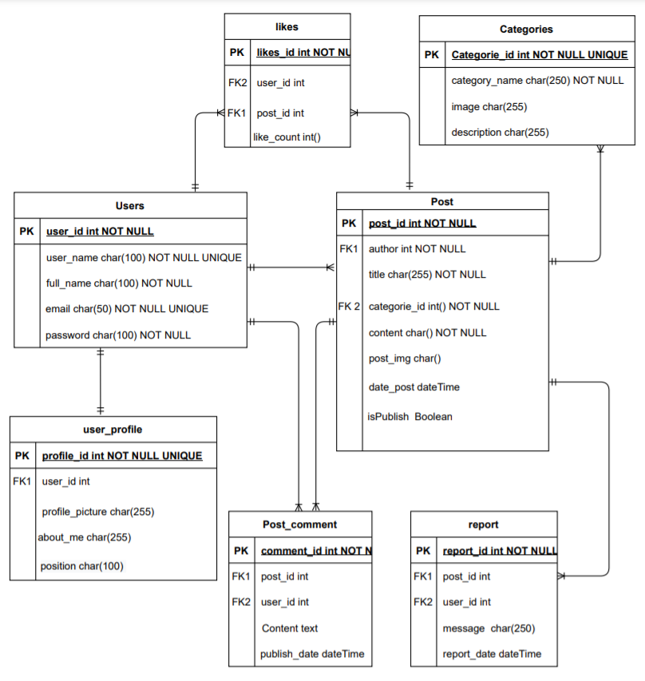

#  Blogy Project 

## Introduction
A blog is an online diary or journal located on a website. Users can create their own blog and post content that typically articles or sharing any information with others for engaging with them.

### Wireframe
Started the app by designing its layout framework by <a href= 'https://wireframepro.mockflow.com/'>mockflow</a>. 


### ERD
Designing the Entity Relationship Diagram by <a href= 'https://app.diagrams.net/'>Draw.io</a>



### Technologies Used.
* HTML
* CSS
* Bootstrap
* Postages 
* Python 
* Django 
* Ajax

### User Stories
#### Admin
* As admin, I should be able to manage blog website
* As admin, I should be able to craete post and published directly
* As admin, I should be able to show list of reports
* As admin, I should be able to show list of publish post requests
* As admin, I should be able to confirm to publish a post on the website
* As admin, I should be able to refused publish a post 
* As admin, I should be able to show list of reports
* As admin, I should be able to access control panel


#### User
* As a User, I should be able to see the post content
* As a User, I should be able to search by post title
* As a User, I should be able to see author profile
* As a User, I should be able to filter the posts by its categories
* As a User, I should be able to sign up
* As a User, I should be able to log in
* As a User, I should be able to reset password
* As a User, I should be able to contact with author by email
* As a User, I should be able to share post link via Facebook, Twitter or Telegram

#### Visited User
* As a visitors User, I should not be neither able edit, delete on post content or add comments

#### Logged In User
* As a logged in user, I should be able to log out
* As a logged in user, I should be able to see all my posts with filtered by status   
* As a logged in user, I should be able to create new post
* As a logged in user, I should be able to edit own post
* As a logged in user, I should be able to delete own post
* As a logged in user, I should be able to add comments to any post
* As a logged in user, I should be able to add likes to the user's posts
* As a logged in user, I should be able to add unlikes to the user's posts
* As a logged in user, I should be able to see all likes posts list
* As a logged in user, I should be able to edit profile information
* As a logged in user, I should be able to edit own comments
* As a logged in user, I should be able to delete own comments
* As a logged in user, I should be able to report any post
* As a logged in user, H should be able to contact with admin by life chating

## App Preview
### The Website Dimo 

## API Endpoints
These are some of the EndPoints we used in this project

| #  |  Action  |  Method |  URL  |  Description  |
| :------------ | :------------ | :------------ | :------------ | :------------ |
|   1| INDEX  | get  | / | To view Home page|
|   2|  CRAETE | POST  |   /login |  To login to the user account|
|   3| CREATE | POST  |/signup   | To create new account|
|   4| INDEX | POST  |/logout   | To log out from the account|
|   5| INDEX | POST  |/profile | To show user's profile|
|   6| CREATE | POST  |/profile/create | To allow the user signed up to create own profile|
|   7| UPDATE | POST  |/profile/<int:pk>/update | To allow the user logged in to modify own profile|
|   8| INDEX | POST  |/profile/<int:user_id>/ | To show specific user profile for others users|
|   5| CREATE  | post  | /post/create | To create new post|
|   6| View | get  | /post/post_id | To veiw exist post|
|   7| EDIT | PATCH  | /post/<int:pk>/update/  | To edit a specific post|
|   8|   INDEX | get  |  /user/posts/|  To view all user's posts list|
|   9|   INDEX |get   |  /user/posts/published// | To view all user's published posts list | 
|   10|    INDEX |get   | /user/posts/notPublished/  | To view all user's unpublished posts list |
|   11|    INDEX |get   | /user/posts/refused/  | To view all user's refused posts list|
|   12|    INDEX |POST   |  /user/posts/draft/ | To view all user's draft posts list|
|   12|    CREATE |POST   |  /category/create/ | To create new category|
|   13|    Update |patch   |   | |
|   14|    Update |patch   |   | |
|   15|    Update |patch   |   | |
|   16|    Update |patch   |   | |

## Code Installation
#### Python 3.8
Follow instructions to install the latest version of python for your platform in the <a href= 'https://docs.python.org/3/using/unix.html#getting-and-installing-the-latest-version-of-python' target="_blank"> python docs </a> 
#### Django 
Installing Django by type on command line `pip install Django` 

#### Running the server
1- clone the repository using this code:
`git clone https://git.generalassemb.ly/ashwagzabani/Project-4`

2- run the flowing command:
```
CREATE DATABASE blogy
python manage.py makemigrations
python manage.py migrate
python manage.py createsuperuser
python manage.py runserver
```
3- Open browser to `http://127.0.0.1:8000` to see the website.

4- Open a tab to `http://127.0.0.1:8000/admin/` to open the admin panel and add some data.


## Future Features:
- As a User, I should be able to share any articles via social networking like: twitter or Facebook
- As a logged User, I should be able to replay on exist comments

## Collaborating
- <a href= 'https://git.generalassemb.ly/ashwagzabani'>Ashwag Zabani</a>
- <a href='https://git.generalassemb.ly/bushra-mulla'>Bushra Mulla</a>
- <a href= 'https://git.generalassemb.ly/fatmahhelal'>Fatimah Alhelal</a>
